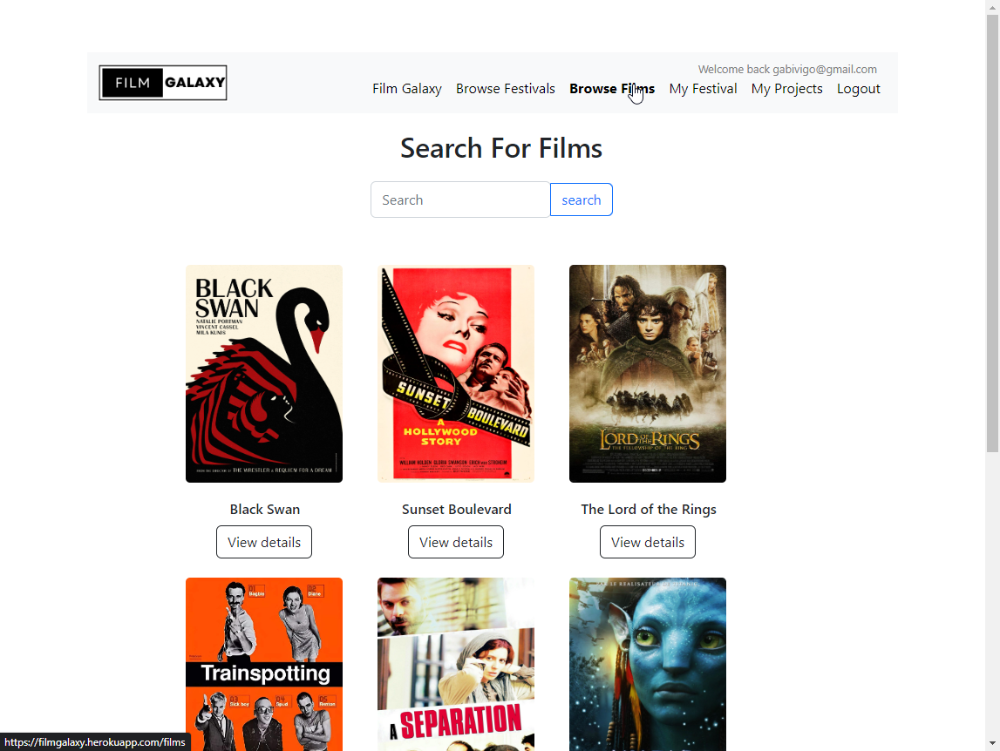

# Description

Film Galaxy is a platform where filmmakers, producers and distributors can submit their films to the member film festivals globally. It also provides a workspace for festival organizers to manage their event.

# How to run this application

In order to run this application you need to add these environment variables to the platform where the site will be running:

```
- MONGODB_URI: The mongodb atlas connection string for the database
- SESSION_SECRET: The key for encrypting the cookies
- Create an account in Cloudinary to upload the images in the application and put the required values from you account (you can find them on the dashboard)
  - CLOUDINARY_KEY
  - CLOUDINARY_NAME
  - CLOUDINARY_SECRET
```

# Demo

Find the live app [here](https://filmgalaxy.adaptable.app/)


<br/>



# Author

**Mog Rouhi && Gabriel Gomez**

* [https://github.com/Mog-Rouhi](https://github.com/Mog-Rouhi)
* [https://github.com/gabriel-vcs](https://github.com/gabriel-vcs)

# License

Copyright © 2022, [Mog Rouhi](https://github.com/Mog-Rouhi), [Gabriel Gomez](https://github.com/gabriel-vcs).
Released under the [MIT License](LICENSE).

---
